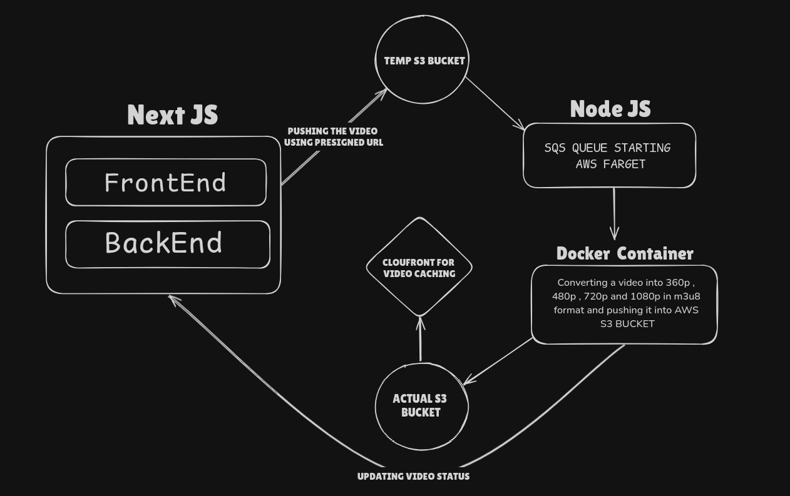

# VidSphere

**VidSphere** is a cutting-edge video streaming platform that enables seamless video upload, transcoding, and playback in multiple resolutions, with support for HLS streaming. Built with modern web technologies, it offers a scalable solution for video content management and delivery.

## Table of Contents

- [Overview](#overview)
- [Features](#features)
- [Tech Stack](#tech-stack)
- [Architecture](#architecture)
- [Installation](#installation)
- [Usage](#usage)
- [Contributing](#contributing)
- [License](#license)

## Overview

VidSphere provides a complete end-to-end video management solution. Users can upload videos, which are then transcoded into multiple resolutions (480p, 720p, 1080p) using a video processing pipeline powered by Node.js and FFmpeg. The platform supports HLS streaming for optimized playback and video segmentation. All transcoded files are stored securely in Amazon S3 buckets, and the platform is optimized for performance and scalability.

## Features

- **Multiple Resolution Transcoding:** Videos are transcoded into 480p, 720p, and 1080p for adaptive streaming.
- **HLS Streaming:** Provides `.m3u8` and `.ts` file formats for seamless, bandwidth-efficient video playback.
- **Secure Video Uploads:** Upload videos securely to Amazon S3 with pre-signed URLs.
- **Video Management:** View, edit, and delete videos through a user-friendly interface.
- **Optimized Backend:** Efficient video processing pipeline using Node.js, SQS, and FFmpeg.
- **Advanced Analytics:** Track video performance and manage metadata.

## Tech Stack

- **Frontend:** Next.js, Tailwind CSS, ShadCN UI
- **Backend:** Node.js, Express.js
- **State Management:** Redux Toolkit
- **Database:** MongoDB
- **Video Transcoding:** FFmpeg
- **Cloud Storage:** Amazon S3
- **Queue Management:** Amazon SQS
- **Streaming Technology:** HLS (HTTP Live Streaming)

## Architecture

VidSphere follows a microservices-based architecture. Video uploads are handled through pre-signed URLs in S3, and once the upload is complete, a message is sent via SQS to the Node.js backend for processing. The videos are then transcoded using FFmpeg, stored back in S3, and streamed to the frontend via HLS. The MongoDB database is used for storing video metadata, user information, and status tracking.



### Workflow:

1. User uploads video to a temporary S3 bucket via a pre-signed URL.
2. Video details are sent to the backend via SQS.
3. Node.js backend processes the video using FFmpeg, generating HLS segments.
4. Transcoded video is uploaded to the final S3 bucket.
5. MongoDB is updated with video metadata and processing status.

## Installation

### Prerequisites:

- Node.js >= 18.x
- MongoDB
- AWS S3 and SQS setup
- FFmpeg installed on the server

### Steps to Install:

1. Clone the repository:

   ```bash
   git clone https://github.com/GARY121github/vidsphere.git
   cd vidsphere
   ```

2. Install dependencies:

   ```bash
   npm ci
   ```

3. Set up your environment variables by creating a `.env` file:

   ```bash
   cp .env.example .env
   ```

   Update the `.env` file with your MongoDB connection string, AWS credentials, and other configurations.

4. Start the development server:
   ```bash
   npm run dev
   ```

## Usage

1. **Upload Video:**
   Navigate to the dashboard and upload a video. The video will automatically be processed and transcoded.

2. **Manage Videos:**
   Use the interface to view, edit, or delete videos. The table view supports pagination for large datasets.

3. **Playback:**
   Videos are streamed using HLS, allowing for adaptive bitrate streaming across devices.

## Contributing

We welcome contributions to VidSphere! To contribute, please follow these steps:

1. Fork the repository.
2. Create a new branch with a descriptive name.
3. Make your changes and commit them with clear messages.
4. Push your changes to your fork.
5. Open a pull request with a detailed description of the changes.

## License

This project is licensed under the MIT License. See the [LICENSE](LICENSE) file for more details.
